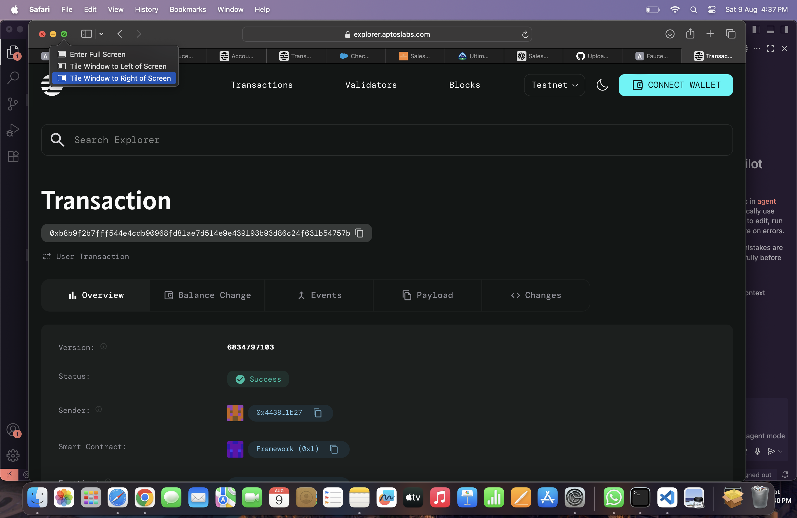

# Rate Limiting Contract

## Project Description

The Rate Limiting Contract is a smart contract built on the Aptos blockchain that implements transaction rate limiting functionality per address. This contract allows users to set maximum transaction limits within specified time windows, helping prevent spam attacks, abuse, and ensuring fair resource usage across the network. The contract provides a decentralized way to manage and enforce rate limits without relying on centralized systems.

## Project Vision

Our vision is to create a robust, decentralized rate limiting infrastructure that enhances the security and stability of blockchain applications. By implementing smart contract-based rate limiting, we aim to:

- Provide developers with easy-to-use tools for preventing abuse in their dApps
- Reduce network congestion caused by spam transactions
- Create a fair and sustainable transaction environment for all users
- Enable customizable rate limiting policies that can adapt to different use cases
- Foster a more secure and reliable blockchain ecosystem

## Key Features

- **Per-Address Rate Limiting**: Individual transaction limits for each wallet address
- **Customizable Time Windows**: Flexible time periods for rate limit enforcement (seconds, minutes, hours)
- **Configurable Transaction Limits**: Set maximum allowed transactions per time window
- **Automatic Window Reset**: Time windows automatically reset, allowing fresh transaction quotas
- **Gas Efficient**: Optimized smart contract design with minimal gas consumption
- **Error Handling**: Comprehensive error codes and validation for robust operation
- **Easy Integration**: Simple API for integration into existing dApps and protocols
- **Real-time Monitoring**: Track current transaction counts and remaining limits

## Future Scope

- **Multi-tier Rate Limiting**: Implement different rate limits based on user tiers or stake amounts
- **Dynamic Rate Adjustment**: Automatic rate limit adjustments based on network congestion
- **Governance Integration**: Community-driven rate limit parameter updates through DAO voting
- **Cross-contract Integration**: Rate limiting shared across multiple smart contracts
- **Analytics Dashboard**: Real-time monitoring and analytics for rate limit usage
- **Whitelist Functionality**: Bypass rate limits for trusted addresses or contracts
- **Advanced Time Windows**: Support for complex time patterns (daily, weekly, monthly limits)
- **Rate Limit NFTs**: Tradeable rate limit quotas as NFT tokens
- **Integration with DeFi Protocols**: Specialized rate limiting for lending, trading, and yield farming
- **Mobile SDK**: Easy integration tools for mobile dApp developers

## Contract Details
0xb8b9f2b7fff544e4cdb90968fd81ae7d514e9e439193b93d86c24f631b54757b
